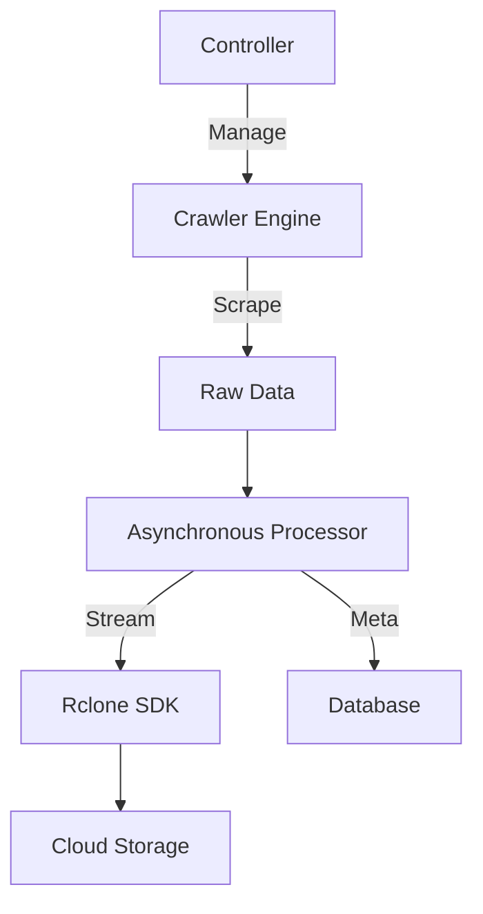

# 📊 Autonomous Data Harvester: AI Training Data Extractor

<div align="center">
  
  
  
  
</div>

---

## 📖 Overview
The **Autonomous Data Harvester** is a high-performance engineering solution designed to discover, scrape, and synchronize large-scale datasets directly to cloud storage.



## ✨ Key Features
- 🕷️ **Recursive Deep Crawling**: Discover datasets across complex web structures.
- ⚡ **Zero-Disk Streaming**: Stream data directly to cloud storage without consuming local disk space.
- 🚀 **High Concurrency**: Utilizes asynchronous I/O for massive throughput.
- ☁️ **Cloud Integration**: Native support for Rclone-based cloud synchronization.
- 📊 **Metadata Generation**: Automatically generates metadata for extracted datasets.

## 🛠️ Tech Stack
- **Engine**: Python (Asyncio, Aiohttp)
- **Crawl Logic**: Playwright / BeautifulSoup4
- **Storage**: Rclone SDK
- **Architecture**: God Mode Engineering (Zero-disk, High-concurrency)

## 🚀 Usage

1. **Clone the repository**:
   ```bash
   git clone https://github.com/shoumikbalasomu/Model_Trainning_Purpose_Data-Extractor.git
   cd Model_Trainning_Purpose_Data-Extractor
   ```

2. **Install dependencies**:
   ```bash
   pip install -r requirements.txt
   ```

3. **Configure Targets**:
   Edit `config.json` with your target URLs and cloud destination.

4. **Run the Extractor**:
   ```bash
   python harvester.py
   ```

## 📜 License
Licensed under the [MIT License](LICENSE). Copyright © 2026 Shoumik Bala Somu.

---

<div align="center">
  <p>Fueling the next generation of AI with high-quality data. 📊🚀</p>
  <p>Part of the Shoumik Family Collection</p>
</div>
